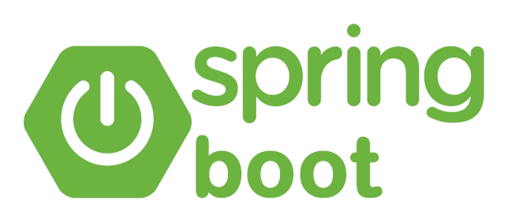

<h1 align="center">Hi 👋, I'm Ridvik! </h1>
<h3 align="center">Third Year Computer Engineering Student at the University Of Toronto</h3>

- 🔭 Currently working on: **Nothing right now, busy with life!**.

- 📚 Currently learning: **A lot of math for university!**
 
- 📫 How to reach me: **Email me at [ridvik.pal@outlook.com](mailto:ridvik.pal@outlook.com)**

- ⚡ Fun fact: **I love stock market investing, music (am an audiophile) and lifting weights!**

- 🚩 Featured: **Check out my latest project, [CarCostAPI](https://github.com/ridvikpal/CarCartAPI), a REST API for used car listings with integrated ChatGPT recommendations!**

<h3 align="left">Connect with me:</h3>

<h3 align="left">Languages and Tools:</h3>

    
    &nbsp;
    
    &nbsp;
    
    &nbsp;
    
    &nbsp;
    
    &nbsp;
    
    &nbsp;
    
    &nbsp;
    
    &nbsp;
    
    &nbsp;
    
    &nbsp;
    
    &nbsp;
    
    &nbsp;
    
    &nbsp;
    
    &nbsp;

    
    

<!-- 
&nbsp;
 -->
