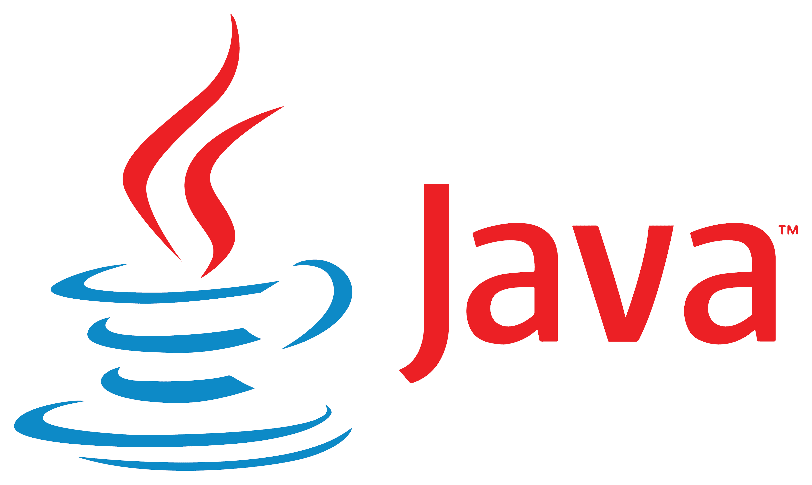
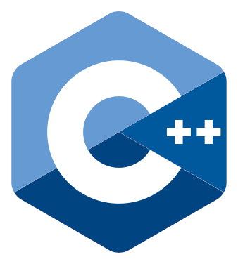

<h1 align="center">Hi 👋, I'm Ridvik! </h1>
<h3 align="center">Third Year Computer Engineering Student at the University Of Toronto</h3>

- 🔭 Currently working on: **[CarCost](https://github.com/ridvikpal/CarCost), a RESTful API built using Java Spring Boot, ChatGPT, and a huge MySQL database of used car listings!**.

- 📚 Currently learning: **The [Spring Framework](https://spring.io/) for [CarCost](https://github.com/ridvikpal/CarCost)**
 
- 📫 How to reach me: **Email me at [pal.ridvik@gmail.com](pal.ridvik@gmail.com)**

- ⚡ Fun fact: **I love music (am an audiophile) and working out!**

- 🚩 Featured: **Check out my latest project, [RainyDay](https://github.com/ridvikpal/RainyDay), a beautifully designed weather app built in Java and styled with CSS**

<h3 align="left">Connect with me:</h3>

<h3 align="left">Languages and Tools:</h3>

    
    &nbsp;
    
    &nbsp;
    
    &nbsp;
    
    &nbsp;
    
    &nbsp;
    
    &nbsp;
    
    &nbsp;
    
    &nbsp;
    
    &nbsp;
    
    &nbsp;
    
    &nbsp;
    
    &nbsp;
    
    &nbsp;
    
    &nbsp;

    
    

<!-- 
&nbsp;
 -->